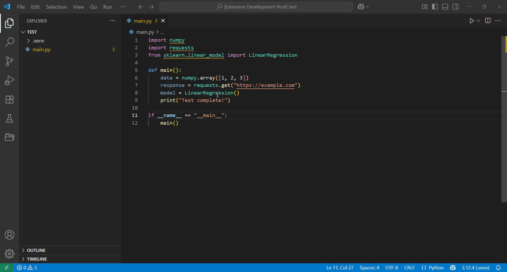

# py-hover-install

A VS Code extension that adds a hover-tooltip link that installs missing Python packages with one click.

* Hover any unresolved `import`.
* Click **Install <package>**.
* A VS Code Task runs `pip install` in its own terminal.



---

## 🔧 Configuration

You can customize where packages are installed by setting a Python interpreter path.

### `pyHoverInstall.installInterpreterPath`

- **Type:** `string` (path to a Python executable)  
- **Default:** *(empty)* → The extension will try to detect a virtual environment in your workspace (`.venv` or `venv`).  
- **Fallback:** If no custom interpreter or venv is found, it will use `python` from your system PATH.

**Example:**

```jsonc
// settings.json
{
  "pyHoverInstall.installInterpreterPath": "/usr/local/bin/python3"
}
